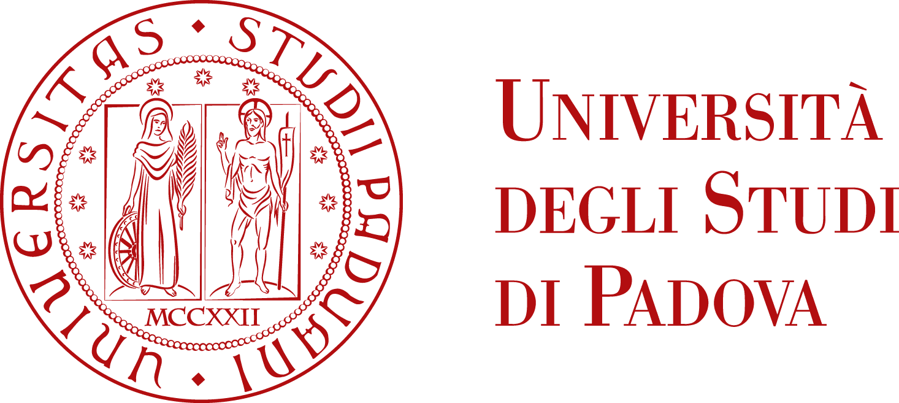

## Introduction

The Methodological Review Board (MRB) is part of the University’s Third Mission and Open Science project – Line B “Development of the Methodological Review Board in Psychology”.

## Overview

The Methodological Review Board is conceived as a multidisciplinary service that supports the development of research projects by providing guidance on formulating research questions, justifying sample size and data collection strategies, selecting appropriate tools for measuring the constructs of interest, and implementing data analysis within a framework of pre-registration and Open Science (e.g., through platforms such as OSF).

::: {.columns}

::: {.column width="33%"}

:::

::: {.column width="33%"}

:::

::: {.column width="33%"}

:::

:::

